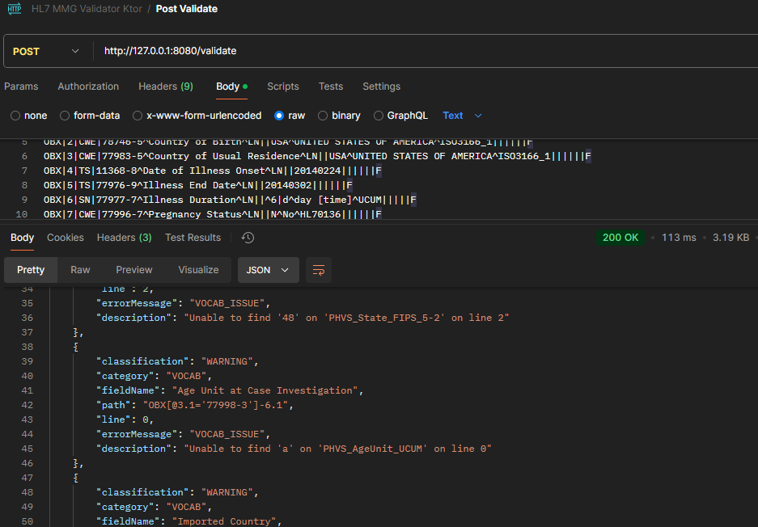

# HL7 MMG Validator with Ktor (Example)
Example of HL7 MMG validation

## Overview

This repo code contains 4 major parts:

- __HL7 MMG validation code in ValidatorMMg__ package, this is currently the same logic as it was developed here: [data-exchange-hl7/deprecated/fn-mmg-validator](https://github.com/CDCgov/data-exchange-hl7/tree/develop/deprecated/fn-mmg-validator)

- __MMGs__ .json assets loader interface, Dependency 1. The current MMG loader implementation is just as an example, __LoaderMMG__
   
- PHINVads __Vocabulary__ interface, Dependency 2. The current Vocab loader implementation is just an example, __LoaderVocab__

- Ktor server is just used an example to produce and visualize the validation report using tools such as postman. This repo was started with the ktor sample project.

## To start the server locally

### Precursory
- Java SDK, developed with java version "17.0.12" 
- Kotlinc compiler, developed with info: kotlinc-jvm 2.1.0 (JRE 17.0.12+8-LTS-286)
- Gradle build tool, developed with Gradle 8.11.1

### VS Code Extensions
- Extension Pack for Java
- Gradle for Java, to clean, build, run
- Kotlin Language

Gradle to clean, build, and run.

### Local Endpoints 
[GET] http://127.0.0.1:8080

[POST] http://127.0.0.1:8080/validate 

### POST Example


## ktor-sample
[Boiler plate ktor sample project, this code base was started with ktor sample]

This project was created using the [Ktor Project Generator](https://start.ktor.io).

Here are some useful links to get you started:

- [Ktor Documentation](https://ktor.io/docs/home.html)
- [Ktor GitHub page](https://github.com/ktorio/ktor)
- The [Ktor Slack chat](https://app.slack.com/client/T09229ZC6/C0A974TJ9). You'll need to [request an invite](https://surveys.jetbrains.com/s3/kotlin-slack-sign-up) to join.

## Features

Here's a list of features included in this project:

| Name                                               | Description                                                 |
| ----------------------------------------------------|------------------------------------------------------------- |
| [Routing](https://start.ktor.io/p/routing-default) | Allows to define structured routes and associated handlers. |

## Building & Running

To build or run the project, use one of the following tasks:

| Task                          | Description                                                          |
| -------------------------------|---------------------------------------------------------------------- |
| `./gradlew test`              | Run the tests                                                        |
| `./gradlew build`             | Build everything                                                     |
| `buildFatJar`                 | Build an executable JAR of the server with all dependencies included |
| `buildImage`                  | Build the docker image to use with the fat JAR                       |
| `publishImageToLocalRegistry` | Publish the docker image locally                                     |
| `run`                         | Run the server                                                       |
| `runDocker`                   | Run using the local docker image                                     |

If the server starts successfully, you'll see the following output:

```
2024-12-04 14:32:45.584 [main] INFO  Application - Application started in 0.303 seconds.
2024-12-04 14:32:45.682 [main] INFO  Application - Responding at http://0.0.0.0:8080
```

## Public Domain Standard Notice
This repository constitutes a work of the United States Government and is not
subject to domestic copyright protection under 17 USC § 105. This repository is in
the public domain within the United States, and copyright and related rights in
the work worldwide are waived through the [CC0 1.0 Universal public domain dedication](https://creativecommons.org/publicdomain/zero/1.0/).
All contributions to this repository will be released under the CC0 dedication. By
submitting a pull request you are agreeing to comply with this waiver of
copyright interest.

## License Standard Notice
The repository utilizes code licensed under the terms of the Apache Software
License and therefore is licensed under ASL v2 or later.

This source code in this repository is free: you can redistribute it and/or modify it under
the terms of the Apache Software License version 2, or (at your option) any
later version.

This source code in this repository is distributed in the hope that it will be useful, but WITHOUT ANY
WARRANTY; without even the implied warranty of MERCHANTABILITY or FITNESS FOR A
PARTICULAR PURPOSE. See the Apache Software License for more details.

You should have received a copy of the Apache Software License along with this
program. If not, see http://www.apache.org/licenses/LICENSE-2.0.html

The source code forked from other open source projects will inherit its license.

## Privacy Standard Notice
This repository contains only non-sensitive, publicly available data and
information. All material and community participation is covered by the
[Disclaimer](DISCLAIMER.md)
and [Code of Conduct](code-of-conduct.md).
For more information about CDC's privacy policy, please visit [http://www.cdc.gov/other/privacy.html](https://www.cdc.gov/other/privacy.html).

## Contributing Standard Notice
Anyone is encouraged to contribute to the repository by [forking](https://help.github.com/articles/fork-a-repo)
and submitting a pull request. (If you are new to GitHub, you might start with a
[basic tutorial](https://help.github.com/articles/set-up-git).) By contributing
to this project, you grant a world-wide, royalty-free, perpetual, irrevocable,
non-exclusive, transferable license to all users under the terms of the
[Apache Software License v2](http://www.apache.org/licenses/LICENSE-2.0.html) or
later.

All comments, messages, pull requests, and other submissions received through
CDC including this GitHub page may be subject to applicable federal law, including but not limited to the Federal Records Act, and may be archived. Learn more at [http://www.cdc.gov/other/privacy.html](http://www.cdc.gov/other/privacy.html).

## Records Management Standard Notice
This repository is not a source of government records, but is a copy to increase
collaboration and collaborative potential. All government records will be
published through the [CDC web site](http://www.cdc.gov).

## Additional Standard Notices
Please refer to [CDC's Template Repository](https://github.com/CDCgov/template) for more information about [contributing to this repository](https://github.com/CDCgov/template/blob/main/CONTRIBUTING.md), [public domain notices and disclaimers](https://github.com/CDCgov/template/blob/main/DISCLAIMER.md), and [code of conduct](https://github.com/CDCgov/template/blob/main/code-of-conduct.md).
